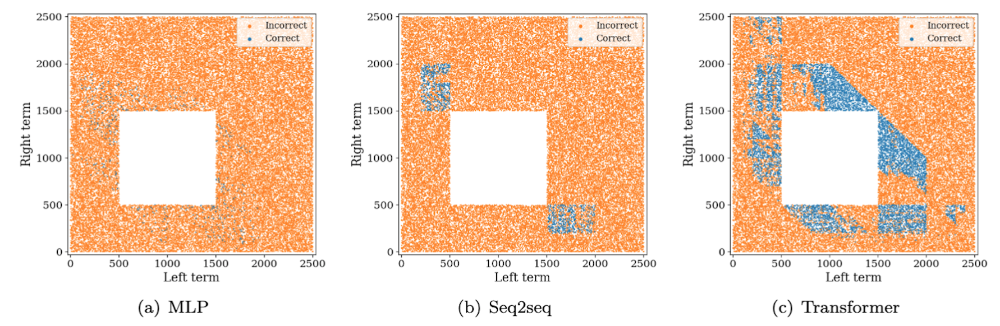

# Addition Experiment for Measuring Extrapolation

This repository provides the implementation of the experiment of the paper "Logical Tasks for Measuring Extrapolation and Rule Comprehension."

## Introduction



This experiment studies the extrapolation behavior of typical neural networks in the addition task. We prepared three types of models; MLP, Seq2seq and Transformer.

This addition task is a supervised learning setup. The inputs consist of two integers and the output is summation of them. Integers and signs like +, = are represented by multiple symbols like natural language processing. Examples for training and test are randomly generated.

## Usage

The following commands train models. The random seed is not fixed, so you will get different results in each trial. You can save the model parameters in different directories by changing `experiment_name` in the config file.

```bash
python train.py -c ../config/main/mlp/000.yaml
python train.py -c ../config/main/seq2seq/000.yaml
python train.py -c ../config/main/transformer/000.yaml
```

The following command generates the data points in the extrapolation regime.

```bash
python generate_extrapolation_examples.py
```

The following command generates the prompt for the pre-trained GPT-NeoX(20B).

```bash
python generate_gpt_prompt.py
```

